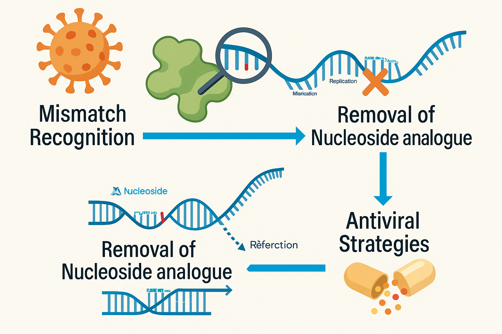

 
<h1>Keerthic Aswin</h1>

<em>PhD scholar in Biological Sciences | Molecular Biologist | Computational Biology Enthusiast</em>

---

## 🧬 About Me

I’m a PhD scholar passionate about decoding how viruses evade treatment through unique proofreading mechanisms. My research focuses on unraveling the molecular workings of viral exonucleases to guide the development of next-generation antiviral strategies. I integrate a multidisciplinary approach—combining Biochemistry, Biophysics, RNA-seq, single-cell RNA-seq, and piRNA mapping—to uncover insights that bridge basic science and therapeutic innovation.

---

## 🔬 Research Projects

- **Coronavirus Research**: Investigating proof-reading mechanism as a therapeutic target in RNA viruses.
During the COVID-19 pandemic, I found myself intrigued by a big question—why did many powerful antivirals fail to control the disease effectively? As I dug deeper, I discovered that coronaviruses have a unique defense: a proofreading exonuclease that detects and removes antiviral drugs, helping the virus maintain its genetic integrity. My PhD journey is centered around decoding how this proofreading mechanism works at the molecular level—and using that knowledge to boost the power of existing antivirals or create smarter, next-generation treatments that can outsmart the virus. This work of mine is kind of offbeat research area of my current PhD lab which primarily delves into cell fate dynamics in neural crest lineages like melanocyte and was possible only because of my curious PI who supported me. 
- **Vitiligo Research**: Investigating translational control in mitochondrial genes as a key factor in melanocyte survival during melanogenesis.
Vitiligo is a complex acquired pigmentary disorder marked by the immune-mediated destruction of melanocytes. While the pathways driving autoimmune responses in vitiligo are increasingly well understood, the reason behind the selective loss of melanocytes remains a mystery. Recently, mitochondrial dysfunction has emerged as a key player in various autoimmune diseases. In our study, we identify a crucial enzyme that supports mitochondrial health during melanogenesis. We found that its downregulation in vitiligo may be linked to impaired mitochondrial function, potentially triggering melanocyte loss and contributing to disease progression.

---

## 📊 Graphical Summary

---

## 📁 Explore More

- [Research Interests](./research.md)
- [Publications & Resources](./publications.md)
- [Contact](./contact.md)

